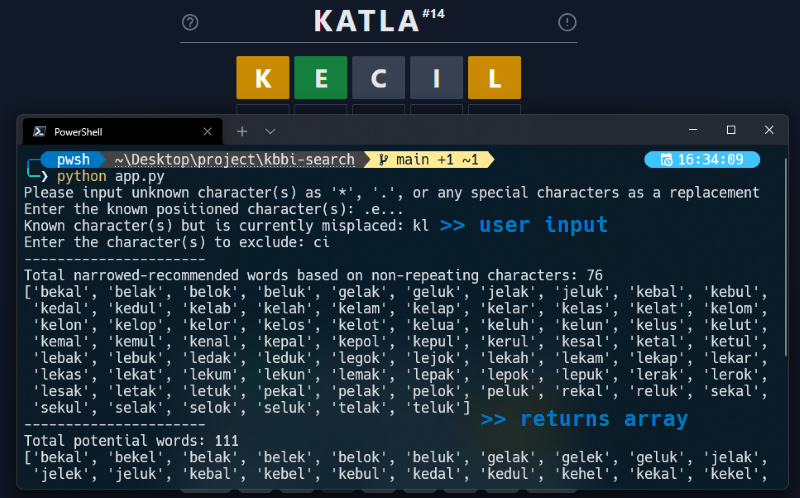
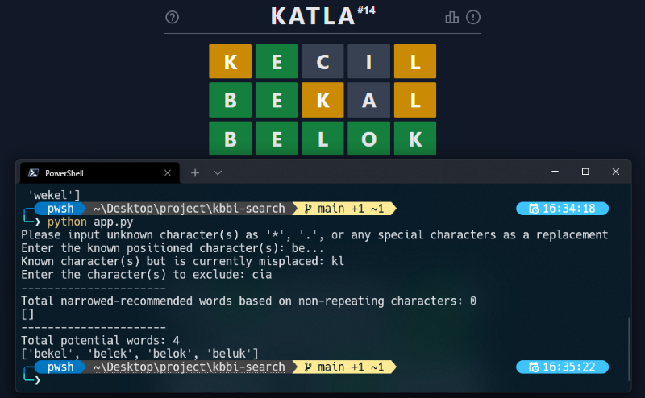

# Katla Helper
Growing up I'm not used to using the formal Bahasa Indonesia, and lately a word game like Wordle, Katla and etc. have been blowing up. It's sometimes agitating knowing a word, but can't express it with the word in the official dictionary, so I decided to create this (well, just a random small project, but whatever)

## How This Works
1. Takes user inputs
    - Character(s) that the user already *know* its position
    - Character(s) that the user knows exists but currently *misplaced*
    - Character(s) that the user knows *doesn't exists*

2. Returns two arrays
    - **Narrowed-recommended words:** array that gives out a potential word(s) that doesn't have any repeating characters-- to further narrow down the word in the next attempt. Use the word from **narrowed-recommended words** array, if you're still dealing with a lot unknown characters.
    - **Potential words:** array that gives out a potential word(s) that exists in the database. Feel free to use the word from **potential words** array, once the array recommendation gets smaller.

## How to Use
1. `git clone` this repo
2. Run the file with `python app.py`

### Notes
- This helper depend solely on the database with only one 1 attribute/column that stores all (I hope) 5 characters words in the dictionary.
- As this is just a *helper*, it's **not** suppose to help you by narrowing down the potential word with the additional information of the position of the misplaced characters nor it's to completely automate the process of finding the word or that's probably because I'm just too lazy to do that